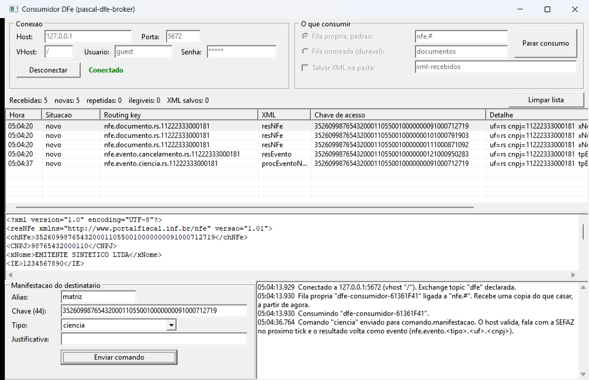

# Consumindo os documentos (qualquer linguagem)

O broker não exige nada do lado de quem consome além de um **cliente AMQP 0-9-1 comum** (pika, amqplib, RabbitMQ.Client, Bunny, o cliente do [pascal-amqp-faa](https://github.com/fabianoallex/pascal-amqp-faa)...). Os exemplos em Python usam o `pika`; foram testados contra o broker embutido.

## Ver funcionando sem certificado

O `tools/demo/DFeDemo` sobe o broker embutido e publica NFes e eventos **sintéticos** pelo mesmo caminho da produção (provider NFe → routing-key → publicador AMQP). Só o "client da SEFAZ" é o simulador dos testes.

```bash
# terminal 1 -- compile: lazbuild tools/demo/DFeDemo.lpi
DFeDemo --porta 5672 --intervalo 5

# terminal 2
pip install pika
python exemplos/consumidor/python/consumir.py --padrao "nfe.#"
```

Saída do consumidor:

```
novo      nfe.documento.sp.12345678000199  cnpj=12345678000199 uf=sp
          resNFe  chave=35260998765432000110550010000000041000316760
          xNome=EMITENTE SINTETICO LTDA, dhEmi=2026-09-10T14:30:05-03:00, vNF=150.00
novo      nfe.evento.cancelamento.sp.12345678000199  cnpj=12345678000199 uf=sp
          resEvento  chave=...  tpEvento=110111
```

Com o host de verdade (`hosts/console` ou o serviço) é igual: aponte `--host/--porta/--usuario/--senha` para o `[broker]` do seu `dfe.ini`.

## Consumidor em Pascal (Delphi e Lazarus)

[`pascal/ConsumidorDFeVcl`](pascal/ConsumidorDFeVcl) é o mesmo consumidor com tela, escrito **só com o lado cliente** do [pascal-amqp-faa](https://github.com/fabianoallex/pascal-amqp-faa) (nenhuma unit do broker é linkada — é a prova de que o cliente AMQP basta). Um só fonte para **VCL (Delphi)** e **LCL (Lazarus/FPC)**, no estilo dos samples da lib.



*A imagem é do build Delphi Win32, com dados sintéticos do simulador: três resumos de NF-e e um cancelamento chegaram; o primeiro documento foi selecionado (a chave foi para o campo) e a ciência enviada; o `nfe.evento.ciencia` na última linha é o resultado.*

O que ele mostra, na ordem do código (`uConsumidorMain.pas` tem o comentário de cada passo):

1. **Conectar** com reconexão automática (a lib refaz fila, binding e consumer sozinha).
2. **Consumir** de dois jeitos: fila **própria** (exclusiva, ligada a um padrão como `nfe.#`) ou fila **nomeada** e durável do `dfe.ini` (ao ligar, mostra quantas mensagens já esperavam).
3. **Processar e só depois confirmar** (`Ack`): "salvar o XML numa pasta" é o processamento; se falhar, a mensagem **não** é confirmada e volta quando o consumo parar.
4. **Deduplicar pela chave de acesso** (a coluna *Situação* mostra `novo` / `REPETIDO`).
5. **Manifestar**: selecione um documento na lista (a chave vai para o campo) e envie o comando; o resultado volta como evento na mesma tela.

`uDFeDocumento.pas` (ler a routing-key e o XML, montar o comando) é uma unit **pura**, sem VCL/LCL/AMQP, e é testada nos dois frameworks (`tests/Unit`, `DFe.ConsumidorDocumentoTests`) — inclusive que o comando que ela monta é aceito pelo `InterpretarComando` do host.

**Compilar e rodar**

- **Lazarus/FPC**: `lazbuild exemplos/consumidor/pascal/ConsumidorDFeVcl/ConsumidorDFeVcl.lpi` (não precisa registrar o pacote da lib: o `.lpi` aponta para `vendor/pascal-amqp-faa/src`; exige o submódulo inicializado).
- **Delphi**: abra `ConsumidorDFeVcl.dproj` (ou o `PascalDfeBroker.groupproj`).

Sem argumentos, abre e você clica **Conectar** → **Iniciar consumo**. Para demonstrar sem clicar: `ConsumidorDFeVcl --auto` (conecta e consome) com `--host=`, `--porta=`, `--fila=documentos` (fila nomeada) e `--salvar=pasta`.

```
# terminal 1
DFeDemo --porta 5672 --intervalo 5        # ou o host + simulador do guia de uso
# terminal 2
ConsumidorDFeVcl --auto
```

Para o ciclo completo com manifestação, use o roteiro de [`docs/guia-de-uso.md`](../../docs/guia-de-uso.md) (simulador + `DFeBrokerConsole`) e, com o host no ar, ligue o consumidor na fila `documentos` (`--fila=documentos`); a ciência volta na fila `eventos` (`--fila=eventos`) como `nfe.evento.ciencia.<uf>.<cnpj>`. Sem host ouvindo, o broker devolve o comando e a tela avisa.

> **Verificado:** compila no **Delphi (VCL, Win32)** e no **Lazarus/FPC (Windows)**; nos dois rodou contra o host + simulador, com manifestação de ida e volta. Só no FPC/LCL: contra o `DFeDemo`, fila nomeada com mensagens acumuladas e gravação dos XML. No Linux, apenas compila e linka (LCL nogui, no `testar-linux.sh`). **Não verificado:** Linux com tela (GTK2/Qt), macOS e Delphi Win64; na tela, a queda e reconexão do broker, o caminho de falha ao salvar (sem `Ack`) e a marca `REPETIDO` (a chave de deduplicação é coberta pelos testes da unit pura, mas nunca chegou uma repetição de verdade).

## O contrato

- **Exchange** `dfe`, tipo **topic**, durável.
- **Routing-key** `<tipo>.<categoria>.<uf>.<cnpj>`, por exemplo `nfe.documento.sp.12345678000199` ou `nfe.evento.cancelamento.sp.12345678000199`. `<cnpj>` é o do **certificado que consultou**, não necessariamente o emitente ou destinatário. Os padrões usam `*` (uma palavra) e `#` (várias): `nfe.evento.#` (todos os eventos), `nfe.documento.sp.*` (documentos de SP, de qualquer CNPJ), `#.12345678000199` (tudo de um CNPJ), `nfe.#` (tudo de NFe).
- **Corpo**: o XML do item, **UTF-8**, `content-type: application/xml`, mensagem persistente.
- **Sem uma fila ligada, o broker descarta** (é pub/sub). Por isso há dois jeitos de consumir:

| Jeito | Como | Quando |
|---|---|---|
| Fila **própria** | o consumidor declara uma fila e a liga a um padrão (`--padrao`) | cada consumidor recebe **uma cópia**; a fila some se ele sair — não guarda o que chegar enquanto ele está fora |
| Fila **nomeada** | o `dfe.ini` declara `[fila:documentos] RoutingKey=nfe.documento.#`; o consumidor só lê (`--fila documentos`) | a fila é durável e **acumula** enquanto ninguém lê; vários consumidores da mesma fila dividem o trabalho |

Para não perder documento por o consumidor estar fora do ar, use fila **nomeada** e durável.

## Entrega "pelo menos uma vez": deduplique pela chave de acesso

Se o broker falhar no meio de um lote, o host repete o lote inteiro; o mesmo documento pode chegar duas vezes. **A chave de acesso (44 dígitos) identifica o documento**: guarde as já processadas e ignore as repetidas. O `consumir.py` mostra isso com um `set` em memória (`REPETIDO`); em produção, use o seu banco. Confirme (`ack`) **depois** de processar, para que uma queda no meio faça o broker entregar de novo.

## Manifestação do destinatário

Publique um comando na exchange `dfe`, routing-key `comando.manifestacao`, com um corpo `chave=valor`:

```
Alias=matriz
ChaveAcesso=35260912345678000199550010000000011000000012
TipoEvento=ciencia
```

`TipoEvento`: `ciencia`, `confirmacao`, `desconhecimento` ou `operacaonaorealizada` (esta exige `Justificativa=` de 15 a 255 caracteres, só com letras/acentos do Latin-1, sem quebra de linha). O script `manifestar.py` monta e envia. O host valida **antes** de falar com a SEFAZ e descarta o que for inválido (aparece no log). O comando é processado no próximo tick do host (até 60 s por padrão).

O **resultado** volta como um evento normal na mesma exchange:

- `nfe.evento.<tipo>.<uf>.<cnpj>` — a SEFAZ registrou (ex.: `nfe.evento.ciencia.sp.…`), corpo = `procEventoNFe`;
- `nfe.evento.manifestacaorejeitada.<uf>.<cnpj>` — a SEFAZ rejeitou; o corpo é a resposta bruta com `cStat`/`xMotivo`.

Assine `nfe.evento.#` para receber os dois.

> **Aviso:** enviar a manifestação à SEFAZ **real** nunca foi exercitado (falta certificado). O caminho até o host (Python → fila → validação → processador) foi testado; o envio em si foi testado contra o simulador.

## Dicas

- Use `127.0.0.1`, não `localhost`: em algumas máquinas `localhost` resolve para `::1`, onde outro programa (WSL, Docker) pode estar na mesma porta.
- Usuário/senha padrão do broker embutido: `guest`/`guest`, escutando só em `127.0.0.1`. Se abrir para a rede (`BindAddress=0.0.0.0`), **troque**.
